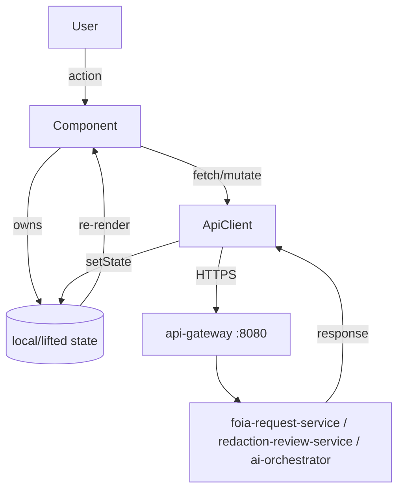

# ADR 0004 — React Component Challenge: <your component name>

Status: Proposed  <!-- pair sets to Accepted when the component is built + defended -->
Date: <YYYY-MM-DD>
Decision-makers: Cohort #1 Pair 3 (both partners)
Source: Phase-2 React Component Challenge — `docs/react-component-challenge.md`

> **THIS IS YOUR DELIVERABLE.** The stub gives you the required sections and
> matches this repo's ADR style (see `0003-retrieval-baseline.md`). Fill every
> section. Hand-written only — no code-gen for this ADR or the component it
> describes (see the attestation). Delete these quoted helper notes before you
> submit.

## Context

> What component did you choose, and what problem in the FOIA-processing domain
> does it serve? Who is the user (FOIA officer / redaction reviewer)? If you
> proposed your own component instead of one of the three suggestions, justify it
> here. State the constraint set: React, from scratch, talks to the backend,
> real interaction, visible state flow. Note any irreversibility/HITL concern
> (release is irreversible — see `docs/hitl-plan.md`).

## Decision

> The component you are building, in specifics:
>
> - **Component name + responsibility** (one job).
> - **Backend contract.** Method, gateway-relative path (route through `:8080`),
>   request shape, response shape, auth/JWT assumption. Name the service behind
>   the gateway (`foia-request-service` :8081 / `redaction-review-service` :8082 /
>   `ai-orchestrator` :8000). If you extended the backend, describe the new
>   endpoint here.
> - **State design.** Which component owns which state; derived vs server state;
>   what is lifted and why; what triggers re-renders.
> - **Failure handling.** The concrete behavior for backend-down / slow / empty /
>   error — and the irreversible-release human-confirmation gate if applicable.

### Component diagram (mermaid — required)

> Replace the skeleton below. It MUST show both state flow and frontend↔backend
> data flow.

## Consequences

> Honest tradeoffs. What did you accept (an extra re-render, a coupling, a
> missing feature, a `agency_id` assumption given multi-tenant debt #10)? What's
> the follow-up work? What gets easier / harder in the Angular→React
> modernization arc because of this choice? Note how the irreversible-release
> gate constrains the design.

## Alternatives Considered

> At minimum: the component idea(s) you rejected, and the one design alternative
> you seriously weighed inside the chosen component (e.g. raw `useEffect` fetch
> vs a server-state library; state local vs lifted; auto-apply vs
> confirm-before-release). For each: why rejected, and what rejecting it cost.
>
> 1. **<alternative>** — rejected because … cost of rejecting: …
> 2. **<alternative>** — rejected because …
