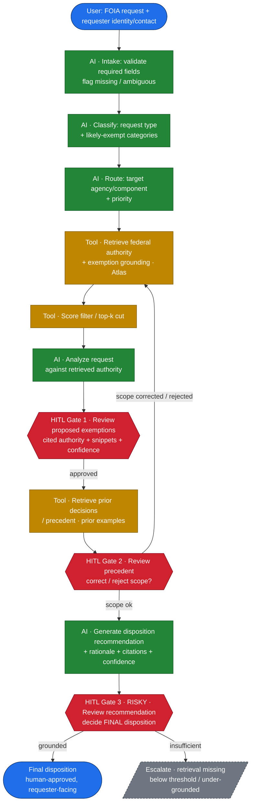

# Agentic FOIA Triage Workflow — Diagram

Visualizes the workflow specified in [ADR 0005](adrs/0005-agentic-foia-triage-workflow.md)
and [`hitl-plan.md`](hitl-plan.md). Node shape/color encodes the tool-vs-AI-vs-gate
split that ADR 0005 §2–3 makes load-bearing.

**Legend** — 🟦 User input · 🟩 AI (LLM) call · 🟧 Tool call (deterministic /
retrieval) · 🟥 HITL gate (human approval).

## Notes

- **Gate 2 loop-back** re-enters at retrieval (`T1`) and re-runs analysis on the
  **approved snapshot + pinned prompt version** — no silent drift (ADR 0005 §3).
- **LLM never retrieves or thresholds.** `T1`/`T2`/`T3` are deterministic tool
  calls so the audit trail records reproducible I/O, not LLM prose.
- **All three gates are human approval points;** Gate 3 is the only
  irreversible, requester-facing decision — the system never auto-releases or
  auto-withholds.
- Every AI node runs **Claude Sonnet** with an assisting-role prompt that states
  the AI does not make the final decision (ADR 0005 §5–6).
